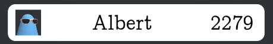

## Primer game:

This is a repository for my strategies to the game [Coin Flip Cheaters: A game from Primer](https://www.youtube.com/watch?v=QC91Bf8hQVo).

`game.py` includes the class `CoinGame` that uses the openai [gym](https://github.com/openai/gym/) base class to set up the environment.

`game_simulation.py` includes the class `CoinGameSimulation` that builds on `CoinGame` and implements a simulation of the game to test out the your strategies or models.

`game_browser.py` includes the class `CoinGameBrowser` that builds on `CoinGame` and iteracts with the online game at [primerlearning.org](https://primerlearning.org/).

## Strategies:

My strategies can be found in the `strategies` directory.
The most succestful one was the simple bayesian strategy.

## How to use:

To get exactly the same dependencies as I used, create the conda environment using:

```bash
conda env create -f environment.yml
```

To use the simulation here is an example, the simulation uses the [gym](https://github.com/openai/gym/) API:

```python
from game_simulation import CoinGameSimulation

def strategy(n_heads, n_tails, flips_left):
    # define your strategy here
    # see game.py for more details
    return 

g = CoinGameSimulation()

(n_heads, n_tails, flips_left) = g.reset()

done = False
while not done:
    action = strategy(n_heads, n_tails, flips_left)
    (n_heads, n_tails, flips_left), reward, done, info = g.step(action)
```	

To use the brower interaction environment you first need to install [FireFox](https://www.mozilla.org/en-US/firefox/new/), [geckodriver](https://github.com/mozilla/geckodriver/releases/) and [Tesseract OCR](https://github.com/tesseract-ocr/tesseract/releases).
You then change the file paths in `game_browser.py` to use your files by changing `geckodriver_path` and `tess.pytesseract.tesseract_cmd`.

The browser interaction environment can then be used with the same [gym](https://github.com/openai/gym/) API:

```python
from game_browser import CoinGameBrowser

def strategy(n_heads, n_tails, flips_left):
    # define your strategy here
    # see game.py for more details
    return 

g = CoinGameBrowser()

(n_heads, n_tails, flips_left) = g.reset()

done = False
while not done:
    action = strategy(n_heads, n_tails, flips_left)
    (n_heads, n_tails, flips_left), reward, done, info = g.step(action)
```	

The notification sound used is taken from
[mixkit.co](https://mixkit.co/free-sound-effects/coin/) 
under the name *Coin win notification*.

## My highscore:

The highest score I have achieved was a 10+ hours overnight run with the following score:

<p align="center" title = "My highscore">
  
</p>